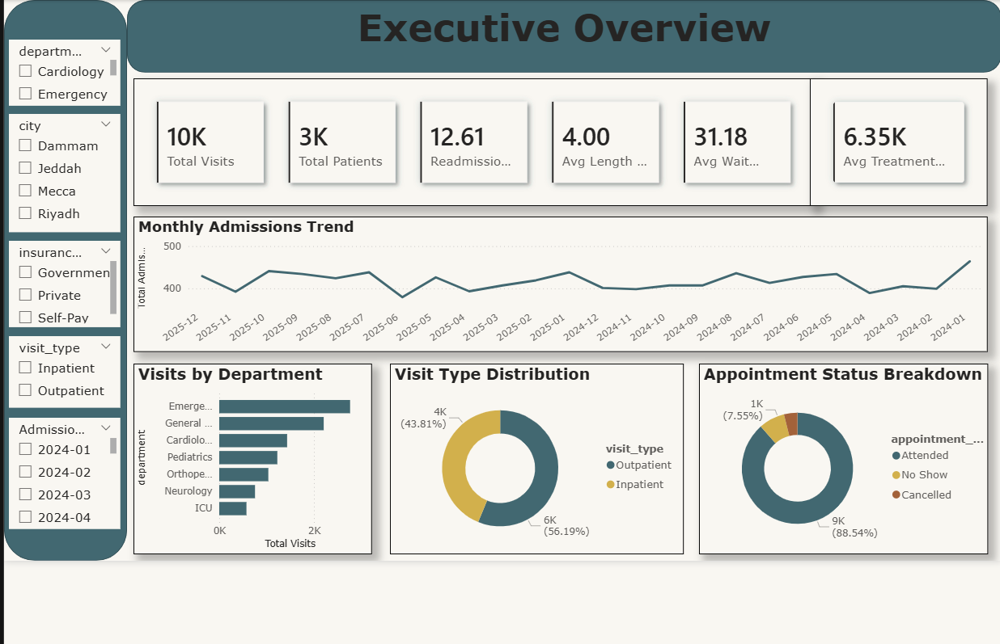
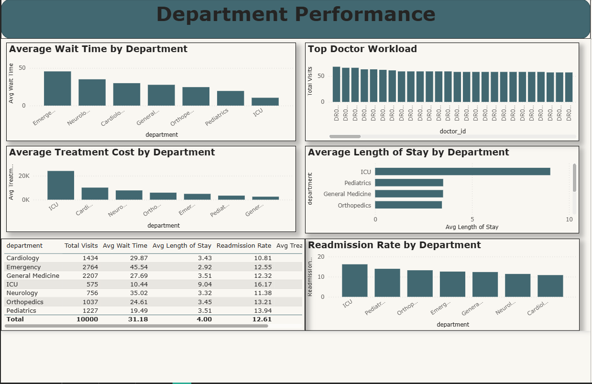
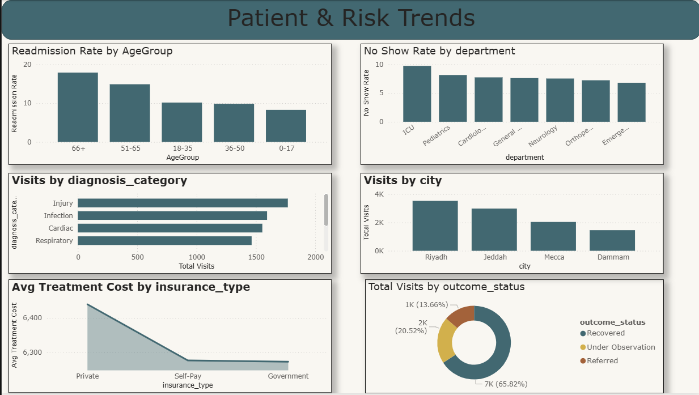

# Hospital Operations & Patient Flow Analysis

A healthcare analytics mini-project focused on patient flow, department performance, readmission trends, wait times, and treatment cost analysis using a synthetic hospital dataset.

---

## Overview

Hospitals and healthcare management teams need clear visibility into patient admissions, discharges, readmissions, wait times, and department workload to improve operational efficiency and support better care decisions.

This project analyzes a synthetic hospital operations dataset to simulate the type of KPI tracking and reporting commonly used in healthcare analytics and clinical operations support.

The analysis focuses on:
- Patient admissions and discharges
- Average length of stay
- 30-day readmission rate
- Department-wise workload
- Appointment no-show behavior
- Wait time patterns
- Treatment cost trends
- Insurance mix and operational efficiency

---

## Project Objective

The goal of this project is to build a healthcare-style analytics workflow that demonstrates how hospital data can be transformed into decision-ready insights.

This project was designed to answer questions such as:
- Which departments handle the highest patient volume?
- Which departments have the longest average wait times?
- What is the average length of stay for inpatient visits?
- Which patient age groups show higher readmission risk?
- How do treatment costs vary across departments and insurance types?
- Where are potential operational bottlenecks?

---

## Dataset

This project uses a **synthetic hospital operations dataset** created for portfolio and learning purposes.

### Dataset Size
- **~10,000 rows**
- Multiple patient visits
- Inpatient and outpatient records
- Multiple hospital departments

### Main Columns
- `patient_id`
- `visit_id`
- `age`
- `gender`
- `admission_date`
- `discharge_date`
- `department`
- `diagnosis_category`
- `visit_type`
- `doctor_id`
- `wait_time_minutes`
- `treatment_cost`
- `insurance_type`
- `appointment_status`
- `readmitted_30_days`
- `outcome_status`
- `bed_assigned`
- `city`
- `admission_source`

### Important Note
This dataset is **synthetic and not based on real patient records**. No real personal or medical data was used.

---

## Business Problem

Healthcare organizations often struggle with fragmented reporting across patient operations, department activity, and resource utilization.

Without clear KPI visibility, it becomes difficult to:
- identify high-burden departments
- monitor readmission risk
- reduce wait times
- improve scheduling efficiency
- understand treatment cost patterns
- support management reporting with clear metrics

This project addresses that gap by building a compact healthcare operations reporting workflow.

---

## KPIs Tracked

The following key performance indicators were analyzed:

- **Total Patients**
- **Total Visits**
- **Total Admissions**
- **Average Length of Stay**
- **30-Day Readmission Rate**
- **Average Wait Time**
- **Average Treatment Cost**
- **Appointment No-Show Rate**
- **Department-wise Patient Volume**
- **Inpatient vs Outpatient Split**

---

## Tools Used

- **SQL** — KPI analysis and aggregation
- **Python (Pandas)** — data cleaning and preprocessing
- **Power BI** — interactive dashboard creation
- **Git & GitHub** — version control and project publishing

---

## Project Workflow

### 1. Data Preparation
- Imported the synthetic hospital dataset
- Converted date columns into proper datetime format
- validated admission and discharge dates
- checked for duplicate visit IDs
- standardized categorical values
- calculated length of stay

### 2. Data Analysis
Used SQL and Python to answer operational healthcare questions related to:
- admissions trend
- average wait time
- readmission rate
- length of stay
- department performance
- cost patterns
- no-show behavior

### 3. Dashboard Development
Created a healthcare-style Power BI dashboard with:
- executive KPI cards
- admissions trend visual
- department performance view
- readmission risk trends
- patient and cost insights

---

## Key Analysis Questions

This project explored questions such as:

1. Which department has the highest number of patient visits?
2. What is the average length of stay for inpatient cases?
3. Which age groups show higher 30-day readmission rates?
4. Which departments have the highest average wait times?
5. How does treatment cost vary by department and insurance type?
6. What is the appointment no-show rate?
7. How do inpatient and outpatient visits compare?
8. Which diagnosis categories are most common?

---

## Sample Insights

Here are examples of the kinds of insights generated from the analysis:

- The **Emergency** department handled the highest patient volume, indicating the greatest operational burden.
- **ICU** showed a lower patient count but significantly higher average treatment cost.
- Older age groups showed relatively higher **readmission rates**, suggesting possible follow-up care challenges.
- Some departments had noticeably longer **average wait times**, which may indicate scheduling or staffing inefficiencies.
- **Inpatient** visits had longer stays and higher treatment costs than outpatient visits.
- Appointment **no-show patterns** may affect resource utilization and planning efficiency.

---

## Dashboard Preview

### Executive Overview

### Department Performance

### Readmission & Patient Trends

> Add your real screenshots into the `images/` folder and update the file names if needed.

---

## SQL Analysis

Some of the SQL analysis performed in this project includes:

- total visits by department
- average length of stay by department
- monthly admissions trend
- readmission rate calculation
- average wait time by department
- average treatment cost by insurance type
- no-show rate analysis
- age-group readmission breakdown

You can find the SQL queries here:

sql/healthcare_kpi_queries.sql

Example SQL Snippet
SELECT 
    department,
    ROUND(AVG(wait_time_minutes), 2) AS avg_wait_time
FROM hospital_data
GROUP BY department
ORDER BY avg_wait_time DESC;

Folder Structure

hospital-operations-analysis/
│
├── data/
│   ├── hospital_data.csv
│   └── cleaned_hospital_data.csv
│
├── sql/
│   └── healthcare_kpi_queries.sql
│
├── notebook/
│   └── hospital_analysis.ipynb
│
├── dashboard/
│   └── hospital_operations_dashboard.pbix
│
├── images/
│   ├── banner.png
│   ├── executive-dashboard.png
│   ├── department-performance.png
│   └── patient-trends.png
│
├── README.md
└── requirements.txt

Business Recommendations

Based on the analysis, healthcare management teams could consider:

Investigating departments with long wait times to reduce service delays
Monitoring high-readmission patient groups more closely
Reviewing staffing and workload distribution in high-volume departments
Improving appointment reminder systems to reduce no-shows
Tracking treatment cost variation across departments and payer types for better operational planning
Why This Project Matters

This project demonstrates the ability to:

work with healthcare-style structured data
define meaningful KPIs
perform SQL-based analysis
build dashboard-driven reporting
translate raw data into operational recommendations

It also shows how core data analyst skills can be applied to the healthcare domain, even when working with a synthetic dataset for learning and portfolio development.

Future Improvements

Possible next steps for this project:

add patient satisfaction analysis
include doctor-level productivity metrics
simulate bed occupancy trends
create a claims and billing analysis layer
add forecasting for admissions and department load
build a Streamlit or Flask app version of the dashboard
Author

Mohammed Saihan
Aspiring Data Analyst | SQL | Power BI | Python | Healthcare Analytics
GitHub

Portfolio
